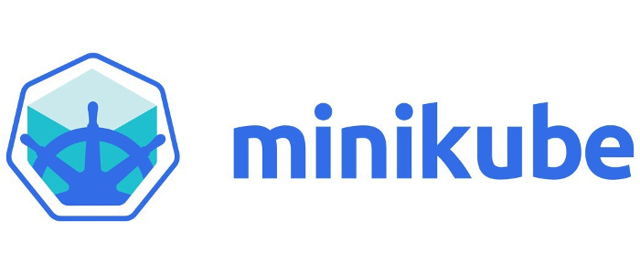

# ÍNDICE 

- **[Introducción](#introduccion)**
	
	- **[¿Qué es Kubernetes?](#queeskubernetes)**
	
	- **[¿Para ofrece?](#queofrece)**

- **[Arquitectura](#arquitectura)**

	- **[Clústers](#clusters)**

	- **[Nodes](#nodes)**
		
		- **[Master](#master)**

			-[API-server](#api)
				
			-[Scheduler](#scheduler)

			-[Controller-manager](#controller)

			-[etcd](#etcd)				

		- **[Workers](#workers)**

			-[Container-runtime](#containerruntime)

			-[Kubetet](#kubelet)

			-[Kube Proxy](#kubeproxy)

- **[Instalación](#instalacion)**
	
	- **[Requisitos hardware](#requisitos)**

	- **[Elementos](#elementos)**

	- **[Minikube](#minikube)**

- **[Replicaset](#replicaset)**

- **[Deployments](#deployments)**

- **[Tags & selectors](#tags)**

- **[Services](#services)**

- **[Namespaces](#namespaces)**

- **[Volumes](#volumnes)**

- **[Bibliografía](#biblio)** 

# INTRODUCCIÓN

Somos Roberto Martínez y Alejandro López, dos alumnos de Administración de Sistemas Informáticos en Red.

Hemos seleccionado  Kubernetes para nuestro proyecto final porque creemos que actualmente es la tecnología puntera en virtualización y alta disponibilidad, lo cual nos puede ser de mucha utilidad en nuestra vida laboral.

## **¿Qué es Kubernetes?**

Kubernetes (timonel o piloto en griego) es un software de orquestación de código abierto que permite implementar, administrar y escalar aplicaciones en  unidades lógicas para gestionarlas y darles visibilidad. 
Tiene un ecosistema grande y en rápido crecimiento. El soporte, las herramientas y los servicios para Kubernetes están ampliamente disponibles.

Kubernetes ofrece un entorno de administración centrado en contenedores, orquesta la infraestructura de cómputo, redes y almacenamiento para que las cargas de trabajo de los usuarios no tengan que hacerlo.
Fue diseñado por Google en 2014 y su diseño estuvo influenciado por el proyecto Borg y donado a la Cloud Native Foundation.

## **¿Qué ofrece?** 

Las principales carácterísticas de K8s (abreviatura de Kubernetes) son las siguientes:

- **Escalado vertical.** En función del uso de CPU que hagamos Kubernetes nos permite el escalado vertical de nuestras aplicaciones de manera automática (autoescalado) o manual (comando).

- **Reparación automática.** En caso de ocurrir un fallo en un contenedor podemos reiniciar automáticamente, así como reemplazarlo o replanificarlo cuando un nodo muere. También nos ofrece la posibilidad de reparar aquellos health checks definidos por el usuario que no respondan.

- **Planificación de nodos y contenedores.** Kubernetes nos ayuda a decidir en qué nodo se ejecutará cada contenedor, en función de los recursos necesarios y otras restricciones. Además, podemos mezclar cargas de trabajo críticas y best-effort con el objetivo de potenciar el ahorro de recursos.

- **Despliegues y rollbacks automáticos.** Podemos desplegar los cambios de manera progresiva cuando actualizamos una aplicación o cambiamos su configuración, y así poder realizar un rollback automático en caso de fallo en alguna de las instancias.

- **Orquestador de contenedores.** Kubernetes permite montar de forma automática el sistema de almacenamiento necesario para los contenedores: en modo local, en un proveedor de cloud pública, o en un sistema de red como NFS, Flocker o Gluster.

- **Almacenamiento persistente.** K8s goza de soporte en plataformas como Amazon Web Services o Google Cloud Platform, y los proveedores (Red Hat, Dell EMC, NetApp, etc) le proporcionan almacenamiento persistente.

- **Descubrimiento de servicios.** Con Kubernetes asignamos a los contenedores sus propias direcciones IP y un nombre DNS específico para cada conjunto de contenedores. Así, no resulta necesario utilizar recursos externos para el descubrimiento de servicios.

- **Seguridad.** Toda nuestra información sensible, como contraseñas o claves ssh, podemos almacenarla de manera segura en secrets. En este sentido, Kubernetes no expone nuestra información confidencial a la hora de desplegar y configurar nuestras aplicaciones.

- **Clusters grandes y heterogéneos.** Kubernetes puede desplegarse en clusters muy grandes, incluyendo contenedores Docker. Por otro lado, nos permite crear un clúster como resultado de combinar diferentes máquinas virtuales o servidores locales.

---

# ARQUITECTURA

## **Clúster**

Un clúster de Kubernetes es un conjunto de máquinas de nodos que ejecutan aplicaciones en contenedores. Si ejecuta Kubernetes, está ejecutando un clúster.

Como mínimo, un clúster contiene un plano de control y una o varias máquinas informáticas o nodos. El control plane es el encargado de mantener el estado deseado del clúster y de controlar, por ejemplo, las aplicaciones que se ejecutan y las imágenes de contenedores que se utilizan. Los nodos son los que realmente ejecutan las aplicaciones y las cargas de trabajo.

La ventaja más importante de Kubernetes es la capacidad de programar y ejecutar contenedores en un grupo de máquinas, ya sean físicas o virtuales, en local o en un cloud, y esto es posible gracias al clúster. Los contenedores de Kubernetes no están ligados a ninguna máquina individual. De hecho, están aislados en el clúster.

Podemos crear clusters en local, en el cloud, híbridos y también minikube, virtualización de un cluster en un solo nodo virtual que se utiliza para hacer tests y que luego explicaremos con más detalle.

## **Nodos**

Un nodo es una máquina de trabajo en Kubernetes, previamente conocida como minion. Un nodo puede ser una máquina virtual o física, dependiendo del tipo de clúster. Hay dos tipos de nodos: master o control plane y workers. Cada uno de ellos ejecuta diferentes procesos según su clasificación:

- ### **Node master:**

	Aquí se encuentran los elementos de Kubernetes que controlan el clúster, junto con los datos sobre su estado y configuración. Los elementos principales de Kubernetes tienen la importante tarea de garantizar que los contenedores se ejecuten en cantidades suficientes y con los recursos necesarios. 
	El plano de control está en contacto permanente con las máquinas informáticas. Garantiza que el clúster se ejecute según la configuración que hayamos elegido.
	Consta de diferentes procesos:

	· **API-Server:**
	Es el componenete que interactúa con el cliente. Se trata del frontend de Kubernetes, recibe las peticiones y actualiza acordemente el estado en etcd.

	· **Scheduler:**
	Este proceso se encarga de decidir en qúe nodo se ejecutaran los pods. Para ello tiene en cuenta los siguientes factores: requisitos de recursos, restricciones de hardware/software/políticas, afinidad y anti-afinidad, localización de datos dependientes, entre otros.

	· **Controller-manager:**
	Es el componente que ejecuta los controles de k8s. Cada controlador es un proceso independiente, pero para reducir la complejidad, todos se compilan en un único binario y se ejecuta en un mismo proceso. Estos controladores incluyen:

    - **Controlador de nodo:** es el responsable de detectar y responder cuándo un nodo deja de funcionar.

    - **Controlador de replicación:** es el responsable de mantener el número correcto de pods para cada controlador de replicación del sistema.
    
    - **Controlador de endpoints:** construye el objeto Endpoints, es decir, hace una unión entre los Services y los Pods.

    - **Controladores de tokens y cuentas de servicio:** crean cuentas y tokens de acceso a la API por defecto para los nuevos Namespaces

	· **Etcd:** Es la base de datos donde se guarda toda la información que utiliza el cluster.

- ### **Node worker:**

	El worker node, nos proporcionara un entrono de ejecución para las aplicaciones. Estas aplicaciones que se encuentran contenerizadas en pods y son controladas por los anteriores processos que hemos descrito del Control Plane que se ejecutan en el Master Node.

	· **Container runtime:** es el software responsable de la ejecución y gestión de los contenedores.

	· **Kubelet:** es el agente que se ejecuta en cada nodo de un clúster y se comunica con los componentes del control plane. Recibe las definiciones del pod del API Server e interacciona con el container runtime para ejecutar contenedores asociados al pod.

	· **Kube-proxy:** es la implementación de un proxy de red y balanceador de carga soportando la abstracción del servicio junto con otras operaciones de red. Es responsable del enrutamiento del tráfico hacia el contenedor correcto basado en la dirección IP y el número de puerto indicados por el control plane

## **Pods**

Un Pod es un grupo de uno o más contenedores, con almacenamiento/red compartidos, y unas especificaciones de cómo ejecutar los contenedores. Los contenidos de un Pod son siempre coubicados, coprogramados y ejecutados en un contexto compartido. Un Pod modela un "host lógico" específico de la aplicación: contiene uno o más contenedores de aplicaciones relativamente entrelazados.

Los contenedores dentro de un Pod comparten dirección IP y puerto, y pueden encontrarse a través de localhost. También pueden comunicarse entre sí mediante comunicaciones estándar entre procesos. Los contenedores en diferentes normalmente se comunican entre sí a través de las IP's.

Las aplicaciones dentro de un Pod también tienen acceso a volúmenes compartidos, que se definen como parte de un Pod y están disponibles para ser montados en el sistema de archivos de cada aplicación.

Al igual que los contenedores de aplicaciones individuales, los Pods se consideran entidades relativamente efímeras (en lugar de duraderas). Como se explica en ciclo de vida del pod, los Pods se crean, se les asigna un identificador único (UID) y se planifican en nodos donde permanecen hasta su finalización (según la política de reinicio) o supresión. Si un nodo muere, los Pods programados para ese nodo se programan para su eliminación después de un período de tiempo de espera. Un Pod dado (definido por su UID) no se "replanifica" a un nuevo nodo; en su lugar, puede reemplazarse por un Pod idéntico, con incluso el mismo nombre si lo desea, pero con un nuevo UID

Los Pods pueden ser usados para alojar pilas de aplicaciones integradas (por ejemplo, LAMP), pero su objetivo principal es apoyar los programas de ayuda coubicados y coadministrados, como:

   · sistemas de gestión de contenido, loaders de datos y archivos, gestores de caché locales, etc.

   · copia de seguridad de registro y punto de control, compresión, rotación, captura de imágenes, etc.

   · observadores de cambio de datos, adaptadores de registro y monitoreo, publicadores de eventos, etc.

   · proxies, bridges y adaptadores.

   · controladores, configuradores y actualizadores.

Los Pods individuales no están diseñados para ejecutar varias instancias de la misma aplicación, en general.

---

# INSTALACIÓN EN ENTORNO DE PRUEBAS

## Requisitos:

- Sistema operativo:
	- Ubuntu 16.+
	- Debian 9+
	- CentOS 7+
	- Red Had Enterprise Linux (RHEL)7
	- Fedora25+
	- HypriotOS v1.0.1+
	- etc.

- 2GB mínimo de RAM para el masters nodes
- 1GB mínimo de RAM para workers nodes
- 2 CPUs mínimo

## Elementos:

Necesitamos tener instalado previamente **docker** para poder trabajar en Kubernetes.
	

Debemos instalar los siguientes componentes: 

- **kubectl**: Aplicación cliente que interactúa con el cluster a través del API a través del API-Server y mediante la líniea de comandos.

- **kubeadm**: Instrucción que nos permite crear el cluster.

- **kubelet**: Es el responsable del estado de ejecución de cada nodo. Se encarga del inicio, la detención y el mantenimiento de los contenedores de aplicaciones (organizados como pods) como es indicado por el master.

- **minikube**: Entorno de pruebas para aprender kubernetes. Es un cluster de un solo nodo lanzado a través de una máquina virtual

		 
		dnf -y install kubeadm kubelet kubectl

## Instalar Minikube en Fedora 32

Para trabajar con ambientes de Kubernetes normalmente es más sencillo poder instalar 
un cluster local en nuestro equipo que nos permita probar de una forma más expedita sin 
tener que interactuar con un servidor externo. Una de las herramientas que nos sirve 
para esta tarea es Minikube.

### Prerequisitos

Para instalar Minikube, se debe validar los siguientes requisitos:

**Validar que la virtualización está soportada en el linux**

		 grep -E --color 'vmx|svm' /proc/cpuinfo

**Tener instalado Kubectl**

		 kubectl version --client 

Si no lo tenemos instalado, lo instalamos.

Para instalar Kubectl vamos a habilitar un YUM repo de Google e instalar el paquete kubectl.

		sudo tee /etc/yum.repos.d/kubernetes.repo<<EOF
		[kubernetes]
		name=Kubernetes
		baseurl=https://packages.cloud.google.com/yum/repos/kubernetes-el7-x86_64
		enabled=1
		gpgcheck=1
		repo_gpgcheck=1
		gpgkey=https://packages.cloud.google.com/yum/doc/yum-key.gpg https://packages.cloud.google.com/yum/doc/rpm-package-key.gpg
		EOF

		sudo dnf makecache

		sudo dnf install kubectl 

**Tener instalado un hipervisor**

Se requiere tener instalado un hipervisor, el Minikube soporta varios pero en este caso
vamos a instalar KVM. Para revisar si lo tenemos instalado podemos validar si está 
habilitado el módulo en el Kernel ejecutando el comando:

		 lsmod | grep kvm

En caso de no tenerlo instalado, lo instalamos.

Para instalarlo, vamos a instalar los siguientes paquetes:

		Instala el KVM
		sudo dnf install bridge-utils libvirt virt-install qemu-kvm

		# Otras herramientas útiles para el KVM
		sudo dnf install virt-top libguestfs-tools

		# Habilita el servicio
		sudo systemctl enable --now libvirtd

		# Instala un administrador gráfico
		sudo dnf install virt-manager

		# Agrega nuestro usuario al grupo del KVM
		sudo usermod -a -G libvirt $(whoami)

### Instalación del binario de Minikube

		# Descarga el binario y le asigna permisos de ejecución
		curl -Lo minikube https://storage.googleapis.com/minikube/releases/latest/minikube-linux-amd64 \
  		&& chmod +x minikube

		# Intenta crear esta ruta en caso de que no exista
		sudo mkdir -p /usr/local/bin/

		# Instala el binario del minikube en la ruta
		sudo install minikube /usr/local/bin/

		# Elimina el binario descargado
		rm minikube

Para probar si todo se instaló bien, podemos crear un cluster de Minikube usando KVM con
los siguientes comandos:

		# Crear un cluster de minikube (default)
		minikube start --driver=kvm2

		# Consulta el estado
		minikube status

		# Para el clúster
		minikube stop

		# Elimina el minikube que se creó para probar
		minikube delete

Por defecto va a crear un cluster de un nodo con la última versión disponible de Kubernetes,
el nodo se le asignarán los recursos:

* vCPU = 2
* Memoria = 6000MB
* Disco = 20000MB

### Crear un cluster minikube personalizado

Con el siguiente comando podemos crear un cluster personalizado de 4 vCPUs, 4 GB de memoria RAM
y 20GB de disco duro, usando la versión 1.17.6 de Kubernetes.

		# Muestra información de los parámetros disponibles para el start
		minikube help start

		# Crea minikube personalizado
		minikube start --driver=kvm2 \
		  --cpus=4 \
		  --memory=4096 \
		  --disk-size=20000mb \
		  --kubernetes-version=1.17.6

Para calcular la memoria RAM, 1024 * los GB que queramos 
Ejemplo de 4GB de memoria RAM

	1024*4= 4096

---

# REPLICASET

Es el componente que se encarga de mantener el número de réplicas de los pods activa.
Alcanza su propósito mediante la creación y eliminación de pods que sea necesario para alcanzar el número que deseamos.

El enlace que un replicaset tiene hacia sus pods es a través del campo del Pod denominado metadata.ownerReferences, el cual indica qué recurso es el propietario del objeto actual.

Un replicaset garantiza que un número específico de réplicas de un pod se está ejecutando en todo momento.
Sin embargo, un deployment es un concepto de más alto nivel que gestiona replicasets y proporciona actualizaciones de forma declarativa de los pods junto con muchas otras características útiles.

Por lo tanto, se recomienda el uso de deployments en vez del uso directo de replicasets, a no ser que se necesite una orquestración personalizada de actualización o no se necesite las actualizaciones en absoluto.

Realizamos un ejemplo de la ultilidad de este objeto:

Analizamos el fichero de configuración

	vim frondend.yaml

		apiVersion: apps/v1
		kind: ReplicaSet
		metadata:
  		  name: frontend
  		    labels:
    		  app: guestbook
    		  tier: frontend
		spec:
  		  # modifica las réplicas según tu caso de uso
  		  replicas: 5
  		  selector:
    	    matchLabels:
      		  tier: frontend
  		  template:
    		metadata:
      		  labels:
        	    tier: frontend
    		spec:
      			containers:
      			- name: php-redis
        		  image: gcr.io/google_samples/gb-frontend:v3

A través del fichero ymal lanzamos la configuración de la réplicas y kubernetes lo crea de manera automatizada.

		kubectl apply -f fronted.yaml

			replicaset.apps/frontend created

Comprovamos el estado del replicaset.
		
		kubectl get replicasets
			
			NAME       DESIRED   CURRENT   READY   AGE
			frontend   5         5         5       16m

Y también la información más detallada.

		kubectl describe rs/frontend

			Name:         frontend
			Namespace:    default
			Selector:     tier=frontend
			Labels:       app=guestbook
            			  tier=frontend
			Annotations:  <none>
			Replicas:     5 current / 5 desired
			Pods Status:  5 Running / 0 Waiting / 0 Succeeded / 0 Failed
			Pod Template:
			  Labels:  tier=frontend
			  Containers:
			   php-redis:
			    Image:        gcr.io/google_samples/gb-frontend:v3
			    Port:         <none>
			    Host Port:    <none>
			    Environment:  <none>
			    Mounts:       <none>
			  Volumes:        <none>
			Events:
			  Type    Reason            Age   From                   Message
			  ----    ------            ----  ----                   -------
			  Normal  SuccessfulCreate  17m   replicaset-controller  Created pod: frontend-vn8rv
			  Normal  SuccessfulCreate  17m   replicaset-controller  Created pod: frontend-pn728
			  Normal  SuccessfulCreate  17m   replicaset-controller  Created pod: frontend-n672g
			  Normal  SuccessfulCreate  17m   replicaset-controller  Created pod: frontend-rrjtb
			  Normal  SuccessfulCreate  17m   replicaset-controller  Created pod: frontend-4nwkk

			

Podemos escalar el número de réplicas del pod que hemos lanzado en caliente.
Para ellos podemos modificar el fichero .yaml y cambiar el número de replicas, en este caso vamos a reducir a 3.

		vim frondend.yaml
			apiVersion: apps/v1
			kind: ReplicaSet
			metadata:
  			  name: frontend
  			    labels:
    			  app: guestbook
    			  tier: frontend
			spec:
  			  replicas: 3
  			  selector:
    		    matchLabels:
      			  tier: frontend
  			  template:
    			metadata:
      			  labels:
        		    tier: frontend
    			spec:
      				containers:
      				- name: php-redis
        			  image: gcr.io/google_samples/gb-frontend:v3

		kubectl apply -f fronted.yaml
			replicaset.apps/frontend configured

Comprobamos como ha cambiado el número de pods que está corriendo en el orquestador.

		kubectl get pods
			NAME             READY   STATUS    RESTARTS   AGE
			frontend-4nwkk   1/1     Running   0          20m
			frontend-n672g   1/1     Running   0          20m
			frontend-pn728   1/1     Running   0          20m

		kubectl get rs
			NAME       DESIRED   CURRENT   READY   AGE
			frontend   3         3         3       21m

También podemos ejecutar la misma acción a través de los comandos de kubectl sin necesidad de modificar el fichero de configuración.
En este caso volveremos a tener 3 réplicas de nuevo.

		kubectl scale replicaset frontend --replicas=5
			replicaset.apps/frontend scaled
			
		kubectl get pods
			NAME             READY   STATUS    RESTARTS   AGE
			frontend-4nwkk   1/1     Running   0          21m
			frontend-kbvvs   1/1     Running   0          25s
			frontend-kwdkl   1/1     Running   0          25s
			frontend-n672g   1/1     Running   0          21m
			frontend-pn728   1/1     Running   0          21m

		kubectl get rs 
			NAME       DESIRED   CURRENT   READY   AGE
			frontend   5         5         5       22m

			
Eliminamos el replicaset

		kubectl delete replicaset frontend
			replicaset.apps "frontend" deleted

		kubectl get rs
			No resources found in default namespace.

---

# DEPLOYMENTS

Una configuración de deployment pide a Kubernetes que cree y actualice las instancias de una aplicación.
Tras crear el deployment, el control plane organiza las instancias de aplicación en los nodos disponibles del cluster.

Una vez creadas las instancias de aplicación, el controlador de Deployment de Kubernetes monitoriza continuamente las instancias.
Si un nodo en el que está una instancia cae o es eliminado, el controlador sustituye la instancia por otra en otro nodo disponible del cluster.

Esta característica de recuperación de fallos mediante la creación de nuevas instancias que reemplazan a las defectuosas o desaparecidas no existía antes de los orquestadores.

Al crear un deployment se especifica la imagen del contenedor que usará la aplicación y el número de réplicas que se quieren mantener en ejecución.
El número de réplicas se puede modificar en cualquier momento actualizando el deployment.

# BIBLIOGRAFÍA

[Arquitectura](https://kubernetes.io/es/docs/concepts/architecture/)

[Crear un cluster](https://kubernetes.io/es/docs/tutorials/kubernetes-basics/create-cluster/)

[Web editor md](https://stackedit.io/app#)

[explicación](https://www.itshellws.org/kubernetes/)

[Componentes arquitectura](https://aprenderdevops.com/arquitectura-de-kubernetes/)

[pdf universidad](https://core.ac.uk/download/pdf/288501998.pdf)

[video arquitectura](https://www.youtube.com/watch?v=8C_SCDbUJTg)

[instalación minikube](https://marvin.monge.me/post/instalar-minikube-en-fedora-32/)

[git uni almeria](https://ualmtorres.github.io/SeminarioKubernetes/#truedeployments)
