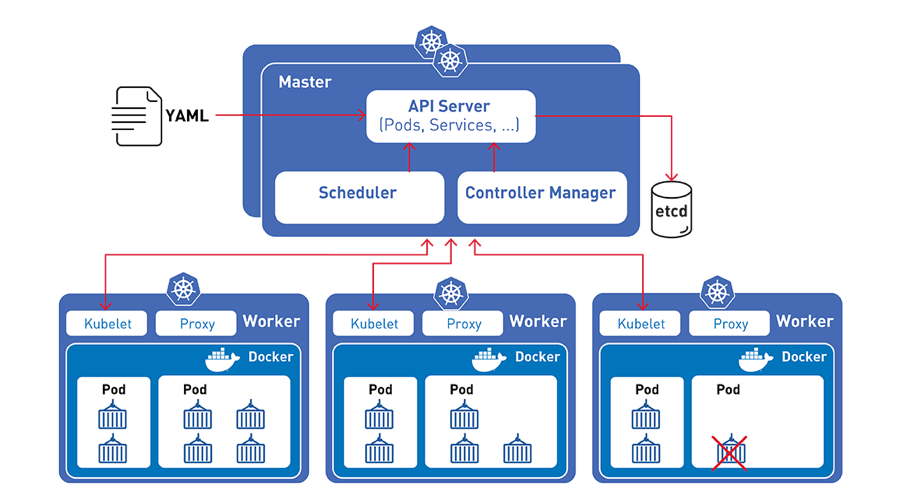
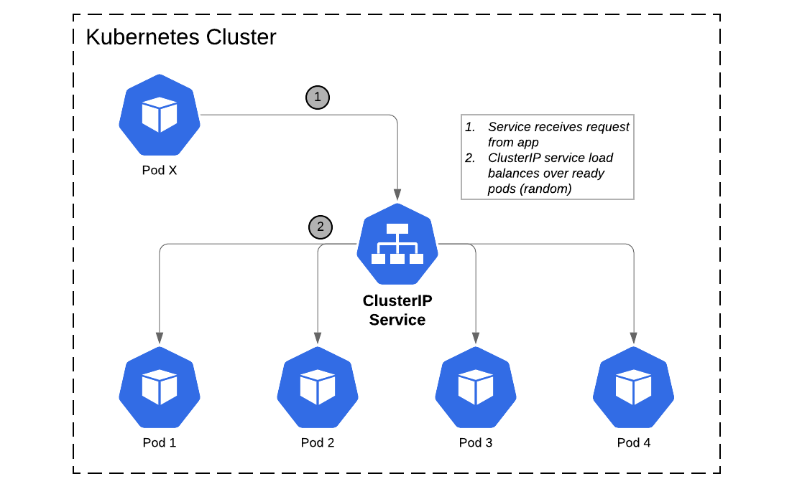
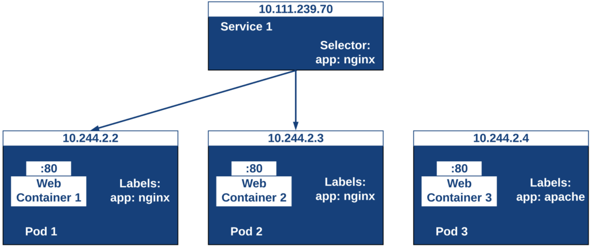

# ÍNDICE 

- **[Introducción](#introduccion)**
	
	- **[¿Qué es Kubernetes?](#queeskubernetes)**
	
	- **[¿Qué ofrece?](#queofrece)**

- **[Arquitectura](#arquitectura)**

	- **[Clústers](#clusters)**

	- **[Nodes](#nodes)**
		
		- **[Master](#master)**

			- [API-server](#api)
				
			- [Scheduler](#scheduler)

			- [Controller-manager](#controller)

			- [etcd](#etcd)				

		- **[Workers](#workers)**

			- [Container-runtime](#containerruntime)

			- [Kubetet](#kubelet)

			- [Kube Proxy](#kubeproxy)
	
	- **[Pods](#pods)**

- **[Instalación](#instalacion)**
	
	- **[Requisitos hardware](#requisitos)**

	- **[Elementos](#elementos)**

	- **[Minikube](#minikube)**

- **[Replicaset](#replicaset)**

- **[Deployment](#deployment)**
	
	- **[Crear](#crear)**

	- **[Actualizar](#actualizar)**

	- **[Historial](#historial)**

	- **[Escalar](#escalar)**

- **[Service/Endpoint](#service)**

- **[Namespaces](#namespaces)**

- **[Volumes](#volumes)**

- **[Bibliografía](#biblio)** 

---

# INTRODUCCIÓN

Somos Roberto Martínez y Alejandro López, dos alumnos de Administración de Sistemas Informáticos en Red.

Hemos seleccionado  Kubernetes para nuestro proyecto final porque creemos que actualmente es la tecnología puntera en virtualización y alta disponibilidad, lo cual nos puede ser de mucha utilidad en nuestra vida laboral.

## **¿Qué es Kubernetes?**

Kubernetes (timonel o piloto en griego) es un software de orquestación de código abierto que permite implementar, administrar y escalar aplicaciones en  unidades lógicas para gestionarlas y darles visibilidad. 
Tiene un ecosistema grande y en rápido crecimiento. El soporte, las herramientas y los servicios para Kubernetes están ampliamente disponibles.

Kubernetes ofrece un entorno de administración centrado en contenedores, orquesta la infraestructura de cómputo, redes y almacenamiento para que las cargas de trabajo de los usuarios no tengan que hacerlo.
Fue diseñado por Google en 2014 y su diseño estuvo influenciado por el proyecto Borg y donado a la Cloud Native Foundation.

## **¿Qué ofrece?**

Las principales carácterísticas de K8s (abreviatura de Kubernetes) son las siguientes:

- **Escalado vertical.** En función del uso de CPU que hagamos Kubernetes nos permite el escalado vertical de nuestras aplicaciones de manera automática (autoescalado) o manual (comando).

- **Reparación automática.** En caso de ocurrir un fallo en un contenedor podemos reiniciar automáticamente, así como reemplazarlo o replanificarlo cuando un nodo muere. También nos ofrece la posibilidad de reparar aquellos health checks definidos por el usuario que no respondan.

- **Planificación de nodos y contenedores.** Kubernetes nos ayuda a decidir en qué nodo se ejecutará cada contenedor, en función de los recursos necesarios y otras restricciones. Además, podemos mezclar cargas de trabajo críticas y best-effort con el objetivo de potenciar el ahorro de recursos.

- **Despliegues y rollbacks automáticos.** Podemos desplegar los cambios de manera progresiva cuando actualizamos una aplicación o cambiamos su configuración, y así poder realizar un rollback automático en caso de fallo en alguna de las instancias.

- **Orquestador de contenedores.** Kubernetes permite montar de forma automática el sistema de almacenamiento necesario para los contenedores: en modo local, en un proveedor de cloud pública, o en un sistema de red como NFS, Flocker o Gluster.

- **Almacenamiento persistente.** K8s goza de soporte en plataformas como Amazon Web Services o Google Cloud Platform, y los proveedores (Red Hat, Dell EMC, NetApp, etc) le proporcionan almacenamiento persistente.

- **Descubrimiento de servicios.** Con Kubernetes asignamos a los contenedores sus propias direcciones IP y un nombre DNS específico para cada conjunto de contenedores. Así, no resulta necesario utilizar recursos externos para el descubrimiento de servicios.

- **Seguridad.** Toda nuestra información sensible, como contraseñas o claves ssh, podemos almacenarla de manera segura en secrets. En este sentido, Kubernetes no expone nuestra información confidencial a la hora de desplegar y configurar nuestras aplicaciones.

- **Clusters grandes y heterogéneos.** Kubernetes puede desplegarse en clusters muy grandes, incluyendo contenedores Docker. Por otro lado, nos permite crear un clúster como resultado de combinar diferentes máquinas virtuales o servidores locales.

---

# ARQUITECTURA

## **Clústers**

Un clúster de Kubernetes es un conjunto de máquinas de nodos que ejecutan aplicaciones en contenedores. Si ejecuta Kubernetes, está ejecutando un clúster.

Como mínimo, un clúster contiene un plano de control y una o varias máquinas informáticas o nodos. El control plane es el encargado de mantener el estado deseado del clúster y de controlar, por ejemplo, las aplicaciones que se ejecutan y las imágenes de contenedores que se utilizan. Los nodos son los que realmente ejecutan las aplicaciones y las cargas de trabajo.

La ventaja más importante de Kubernetes es la capacidad de programar y ejecutar contenedores en un grupo de máquinas, ya sean físicas o virtuales, en local o en un cloud, y esto es posible gracias al clúster. Los contenedores de Kubernetes no están ligados a ninguna máquina individual. De hecho, están aislados en el clúster.

Podemos crear clusters en local, en el cloud, híbridos y también minikube, virtualización de un cluster en un solo nodo virtual que se utiliza para hacer tests y que luego explicaremos con más detalle.

## **Nodes**

Un nodo es una máquina de trabajo en Kubernetes, previamente conocida como minion. Un nodo puede ser una máquina virtual o física, dependiendo del tipo de clúster. Hay dos tipos de nodos: master o control plane y workers. Cada uno de ellos ejecuta diferentes procesos según su clasificación:

- ### **Node master:**

	Aquí se encuentran los elementos de Kubernetes que controlan el clúster, junto con los datos sobre su estado y configuración. Los elementos principales de Kubernetes tienen la importante tarea de garantizar que los contenedores se ejecuten en cantidades suficientes y con los recursos necesarios. 
	El plano de control está en contacto permanente con las máquinas informáticas. Garantiza que el clúster se ejecute según la configuración que hayamos elegido.
	Consta de diferentes procesos:

	· **API-Server:**
	Es el componenete que interactúa con el cliente. Se trata del frontend de Kubernetes, recibe las peticiones y actualiza acordemente el estado en etcd.

	· **Scheduler:**
	Este proceso se encarga de decidir en qúe nodo se ejecutaran los pods. Para ello tiene en cuenta los siguientes factores: requisitos de recursos, restricciones de hardware/software/políticas, afinidad y anti-afinidad, localización de datos dependientes, entre otros.

	· **Controller-manager:**
	Es el componente que ejecuta los controles de k8s. Cada controlador es un proceso independiente, pero para reducir la complejidad, todos se compilan en un único binario y se ejecuta en un mismo proceso. Estos controladores incluyen:

    - **Controlador de nodo:** es el responsable de detectar y responder cuándo un nodo deja de funcionar.

    - **Controlador de replicación:** es el responsable de mantener el número correcto de pods para cada controlador de replicación del sistema.
    
    - **Controlador de endpoints:** construye el objeto Endpoints, es decir, hace una unión entre los Services y los Pods.

    - **Controladores de tokens y cuentas de servicio:** crean cuentas y tokens de acceso a la API por defecto para los nuevos Namespaces

	· **Etcd:**
	 Es la base de datos donde se guarda toda la información que utiliza el cluster.

- ### **Node worker:**

	El worker node, nos proporcionara un entrono de ejecución para las aplicaciones. Estas aplicaciones que se encuentran contenerizadas en pods y son controladas por los anteriores processos que hemos descrito del Control Plane que se ejecutan en el Master Node.

	· **Container runtime:**
		es el software responsable de la ejecución y gestión de los contenedores.

	· **Kubelet:**
		es el agente que se ejecuta en cada nodo de un clúster y se comunica con los componentes del control plane. Recibe las definiciones del pod del API Server e interacciona con el container runtime para ejecutar contenedores asociados al pod.

	· **Kube-proxy:**
		es la implementación de un proxy de red y balanceador de carga soportando la abstracción del servicio junto con otras operaciones de red. Es responsable del enrutamiento del tráfico hacia el contenedor correcto basado en la dirección IP y el número de puerto indicados por el control plane

## **Pods**

Un Pod es un grupo de uno o más contenedores, con almacenamiento/red compartidos, y unas especificaciones de cómo ejecutar los contenedores. Los contenidos de un Pod son siempre coubicados, coprogramados y ejecutados en un contexto compartido. Un Pod modela un "host lógico" específico de la aplicación: contiene uno o más contenedores de aplicaciones relativamente entrelazados.

Los contenedores dentro de un Pod comparten dirección IP y puerto, y pueden encontrarse a través de localhost. También pueden comunicarse entre sí mediante comunicaciones estándar entre procesos. Los contenedores en diferentes normalmente se comunican entre sí a través de las IP's.

Las aplicaciones dentro de un Pod también tienen acceso a volúmenes compartidos, que se definen como parte de un Pod y están disponibles para ser montados en el sistema de archivos de cada aplicación.

Al igual que los contenedores de aplicaciones individuales, los Pods se consideran entidades relativamente efímeras (en lugar de duraderas). Como se explica en ciclo de vida del pod, los Pods se crean, se les asigna un identificador único (UID) y se planifican en nodos donde permanecen hasta su finalización (según la política de reinicio) o supresión. Si un nodo muere, los Pods programados para ese nodo se programan para su eliminación después de un período de tiempo de espera. Un Pod dado (definido por su UID) no se "replanifica" a un nuevo nodo; en su lugar, puede reemplazarse por un Pod idéntico, con incluso el mismo nombre si lo desea, pero con un nuevo UID

Los Pods pueden ser usados para alojar pilas de aplicaciones integradas (por ejemplo, LAMP), pero su objetivo principal es apoyar los programas de ayuda coubicados y coadministrados, como:

   · Sistemas de gestión de contenido, loaders de datos y archivos, gestores de caché locales, etc.

   · Copia de seguridad de registro y punto de control, compresión, rotación, captura de imágenes, etc.

   · Observadores de cambio de datos, adaptadores de registro y monitoreo, publicadores de eventos, etc.

   · Proxies, bridges y adaptadores.

   · Controladores, configuradores y actualizadores.

Los Pods individuales no están diseñados para ejecutar varias instancias de la misma aplicación, en general.

---

# INSTALACIÓN EN ENTORNO DE PRUEBAS

## Requisitos:

- Sistema operativo:
	- Ubuntu 16.+
	- Debian 9+
	- CentOS 7+
	- Red Had Enterprise Linux (RHEL)7
	- Fedora25+
	- HypriotOS v1.0.1+
	- etc.

- 2GB mínimo de RAM para el masters nodes
- 1GB mínimo de RAM para workers nodes
- 2 CPUs mínimo

## Elementos:

Necesitamos tener instalado previamente **docker** para poder trabajar en Kubernetes.
	
https://docs.docker.com/engine/install/

Debemos instalar los siguientes componentes: 

- **kubectl**: Aplicación cliente que interactúa con el cluster a través del API a través del API-Server y mediante la líniea de comandos.

- **kubeadm**: Instrucción que nos permite crear el cluster.

- **kubelet**: Es el responsable del estado de ejecución de cada nodo. Se encarga del inicio, la detención y el mantenimiento de los contenedores de aplicaciones (organizados como pods) como es indicado por el master.

- **minikube**: Entorno de pruebas para aprender kubernetes. Es un cluster de un solo nodo lanzado a través de una máquina virtual

		 
		dnf -y install kubeadm kubelet kubectl

## Instalar Minikube en Fedora 32

Para trabajar con ambientes de Kubernetes normalmente es más sencillo poder instalar 
un cluster local en nuestro equipo que nos permita probar de una forma más expedita sin 
tener que interactuar con un servidor externo. Una de las herramientas que nos sirve 
para esta tarea es Minikube.

### Prerequisitos

Para instalar Minikube, se debe validar los siguientes requisitos:

**Validar que la virtualización está soportada en el linux**

		 grep -E --color 'vmx|svm' /proc/cpuinfo

**Tener instalado Kubectl**

		 kubectl version --client 

Si no lo tenemos instalado, lo instalamos.

Para instalar Kubectl vamos a habilitar un YUM repo de Google e instalar el paquete kubectl.

		$ sudo tee /etc/yum.repos.d/kubernetes.repo<<EOF
		[kubernetes]
		name=Kubernetes
		baseurl=https://packages.cloud.google.com/yum/repos/kubernetes-el7-x86_64
		enabled=1
		gpgcheck=1
		repo_gpgcheck=1
		gpgkey=https://packages.cloud.google.com/yum/doc/yum-key.gpg https://packages.cloud.google.com/yum/doc/rpm-package-key.gpg
		EOF

		$ sudo dnf makecache

		$ sudo dnf install kubectl 

**Tener instalado un hipervisor**

Se requiere tener instalado un hipervisor, el Minikube soporta varios pero en este caso
vamos a instalar KVM. Para revisar si lo tenemos instalado podemos validar si está 
habilitado el módulo en el Kernel ejecutando el comando:

		 $ lsmod | grep kvm

En caso de no tenerlo instalado, lo instalamos.

Para instalarlo, vamos a instalar los siguientes paquetes:

	Instala el KVM
		$ sudo dnf install bridge-utils libvirt virt-install qemu-kvm

	Otras herramientas útiles para el KVM
		$ sudo dnf install virt-top libguestfs-tools

	Habilita el servicio
		$ sudo systemctl enable --now libvirtd

	Instala un administrador gráfico
		$ sudo dnf install virt-manager

	Agrega nuestro usuario al grupo del KVM
		$ sudo usermod -a -G libvirt $(whoami)

### Instalación del binario de Minikube

	Descarga el binario y le asigna permisos de ejecución
		$ curl -Lo minikube https://storage.googleapis.com/minikube/releases/latest/minikube-linux-amd64 \
  		&& chmod +x minikube

	Intenta crear esta ruta en caso de que no exista
		$ sudo mkdir -p /usr/local/bin/

	Instala el binario del minikube en la ruta
		$ sudo install minikube /usr/local/bin/

	Elimina el binario descargado
		$ rm minikube

Para probar si todo se instaló bien, podemos crear un cluster de Minikube usando KVM con
los siguientes comandos:

	Crear un cluster de minikube (default)
		$ minikube start --driver=kvm2

	Consulta el estado
		$ minikube status

	Para el clúster
		$ minikube stop

	Elimina el minikube que se creó para probar
		$ minikube delete

Por defecto va a crear un cluster de un nodo con la última versión disponible de Kubernetes,
el nodo se le asignarán los recursos:

* vCPU = 2
* Memoria = 6000MB
* Disco = 20000MB

### Crear un cluster minikube personalizado

Con el siguiente comando podemos crear un cluster personalizado de 4 vCPUs, 4 GB de memoria RAM
y 20GB de disco duro, usando la versión 1.17.6 de Kubernetes.

	Muestra información de los parámetros disponibles para el start
		$ minikube help start

	Crea minikube personalizado
		$ minikube start --driver=kvm2 \
		  --cpus=4 \
		  --memory=4096 \
		  --disk-size=20000mb \
		  --kubernetes-version=1.17.6

Para calcular la memoria RAM, 1024 * los GB que queramos 
Ejemplo de 4GB de memoria RAM

	1024*4= 4096

---

# REPLICASET

Es el componente que se encarga de mantener el número de réplicas de los pods activa.
Alcanza su propósito mediante la creación y eliminación de pods que sea necesario para alcanzar el número que deseamos.

El enlace que un replicaset tiene hacia sus pods es a través del campo del Pod denominado metadata.ownerReferences, el cual indica qué recurso es el propietario del objeto actual.

Un replicaset garantiza que un número específico de réplicas de un pod se está ejecutando en todo momento.
Sin embargo, un deployment es un concepto de más alto nivel que gestiona replicasets y proporciona actualizaciones de forma declarativa de los pods junto con muchas otras características útiles.

Por lo tanto, se recomienda el uso de deployments en vez del uso directo de replicasets, a no ser que se necesite una orquestración personalizada de actualización o no se necesite las actualizaciones en absoluto.

### Crear replicaset

Realizamos un ejemplo de la ultilidad de este objeto:

Analizamos el fichero de configuración

	$ vim frondend.yaml
		apiVersion: apps/v1
		kind: ReplicaSet
		metadata:
  		  name: frontend
  		    labels:
    		  app: guestbook
    		  tier: frontend
		spec:
  		  # modifica las réplicas según tu caso de uso
  		  replicas: 5
  		  selector:
    	    matchLabels:
      		  tier: frontend
  		  template:
    		metadata:
      		  labels:
        	    tier: frontend
    		spec:
      			containers:
      			- name: php-redis
        		  image: gcr.io/google_samples/gb-frontend:v3

A través del fichero ymal lanzamos la configuración de la réplicas y kubernetes lo crea de manera automatizada.

		$ kubectl apply -f fronted.yaml
			replicaset.apps/frontend created

Comprovamos el estado del replicaset.
		
		$ kubectl get replicasets
			NAME       DESIRED   CURRENT   READY   AGE
			frontend   5         5         5       16m

Y también la información más detallada.

		$ kubectl describe rs/frontend

			Name:         frontend
			Namespace:    default
			Selector:     tier=frontend
			Labels:       app=guestbook
            			  tier=frontend
			Annotations:  <none>
			Replicas:     5 current / 5 desired
			Pods Status:  5 Running / 0 Waiting / 0 Succeeded / 0 Failed
			Pod Template:
			  Labels:  tier=frontend
			  Containers:
			   php-redis:
			    Image:        gcr.io/google_samples/gb-frontend:v3
			    Port:         <none>
			    Host Port:    <none>
			    Environment:  <none>
			    Mounts:       <none>
			  Volumes:        <none>
			Events:
			  Type    Reason            Age   From                   Message
			  ----    ------            ----  ----                   -------
			  Normal  SuccessfulCreate  17m   replicaset-controller  Created pod: frontend-vn8rv
			  Normal  SuccessfulCreate  17m   replicaset-controller  Created pod: frontend-pn728
			  Normal  SuccessfulCreate  17m   replicaset-controller  Created pod: frontend-n672g
			  Normal  SuccessfulCreate  17m   replicaset-controller  Created pod: frontend-rrjtb
			  Normal  SuccessfulCreate  17m   replicaset-controller  Created pod: frontend-4nwkk

### Escalar pods con replicaset

Podemos escalar el número de réplicas del pod que hemos lanzado en caliente.
Para ellos podemos modificar el fichero .yaml y cambiar el número de replicas, en este caso vamos a reducir a 3.

		$ vim frondend.yaml
			apiVersion: apps/v1
			kind: ReplicaSet
			metadata:
  			  name: frontend
  			    labels:
    			  app: guestbook
    			  tier: frontend
			spec:
  			  replicas: 3
  			  selector:
    		    matchLabels:
      			  tier: frontend
  			  template:
    			metadata:
      			  labels:
        		    tier: frontend
    			spec:
      				containers:
      				- name: php-redis
        			  image: gcr.io/google_samples/gb-frontend:v3

		$ kubectl apply -f fronted.yaml
			replicaset.apps/frontend configured

Comprobamos como ha cambiado el número de pods que está corriendo en el orquestador.

		$ kubectl get pods
			NAME             READY   STATUS    RESTARTS   AGE
			frontend-4nwkk   1/1     Running   0          20m
			frontend-n672g   1/1     Running   0          20m
			frontend-pn728   1/1     Running   0          20m

		$ kubectl get rs
			NAME       DESIRED   CURRENT   READY   AGE
			frontend   3         3         3       21m

También podemos ejecutar la misma acción a través de los comandos de kubectl sin necesidad de modificar el fichero de configuración.
En este caso volveremos a tener 3 réplicas de nuevo.

		$ kubectl scale replicaset frontend --replicas=5
			replicaset.apps/frontend scaled
			
		$ kubectl get pods
			NAME             READY   STATUS    RESTARTS   AGE
			frontend-4nwkk   1/1     Running   0          21m
			frontend-kbvvs   1/1     Running   0          25s
			frontend-kwdkl   1/1     Running   0          25s
			frontend-n672g   1/1     Running   0          21m
			frontend-pn728   1/1     Running   0          21m

		$ kubectl get rs 
			NAME       DESIRED   CURRENT   READY   AGE
			frontend   5         5         5       22m

### Eliminar repilcaset
			
Eliminamos el replicaset

		$ kubectl delete replicaset frontend
			replicaset.apps "frontend" deleted

		$ kubectl get rs
			No resources found in default namespace.

---

# DEPLOYMENT

Una configuración de deployment pide a Kubernetes que cree y actualice las instancias de una aplicación.
Tras crear el deployment, el control plane organiza las instancias de aplicación en los nodos disponibles del cluster.

Una vez creadas las instancias de aplicación, el controlador de Deployment de Kubernetes monitoriza continuamente las instancias.
Si un nodo en el que está una instancia cae o es eliminado, el controlador sustituye la instancia por otra en otro nodo disponible del cluster.

Esta característica de recuperación de fallos mediante la creación de nuevas instancias que reemplazan a las defectuosas o desaparecidas no existía antes de los orquestadores.

Al crear un deployment se especifica la imagen del contenedor que usará la aplicación y el número de réplicas que se quieren mantener en ejecución.
El número de réplicas se puede modificar en cualquier momento actualizando el deployment.

### Crear deployment

Vamos a crear un ejemplo de un deployment que crea un replicaset de pods de un servidor wen nginx.

		$ vim deployment-nginx
			apiVersion: apps/v1
			kind: Deployment
			metadata:
			  name: nginx-deployment
			  labels:
			    app: nginx
			spec:
			  replicas: 3
			  selector:
			    matchLabels:
			      app: nginx
  		     	template:
		      metadata:
 			    labels:
     			  app: nginx
    			spec:
   			  containers:
    		  - name: nginx
 		        image: nginx:1.7.9
 		        ports:
  		        - containerPort: 80

Creamos un Deployment denominado nginx-deployment, indicado a través del campo **.metadata.name.**

El deployment crea tres pods replicados, indicado a través del campo **replicas.**

El campo selector define cómo el deployment identifica los pods que debe gestionar. En este caso, simplemente seleccionamos una etiqueta que se define en la plantilla Pod (app: nginx).

**matchLabels** es un mapa de entradas {clave,valor}.

El campo template contiene los siguientes sub-campos:

- Los Pods se etiquetan como app: nginx usando el campo **labels.**

- La especificación de la plantilla Pod, o el campo **.template.spec**, indica que los pods ejecutan un contenedor, nginx, que utiliza la versión 1.7.9 de la imagen de nginx.
    
- Crea un contenedor y lo llamar nginx usando el campo **name.**

- Ejecuta la imagen nginx en su versión 1.7.9.

- Abre el puerto 80 para que el contenedor pueda enviar y recibir tráfico.

Creamos el deployment ejecutando el cliente kubectl.

		$ kubectl apply -f nginx-deployment.yaml
			deployment.apps/nginx-deployment created

Inspeccionamos el deployment lanzado en nuestro clúster con los siguientes comandos.

		$ kubectl get deployments
			NAME               READY   UP-TO-DATE   AVAILABLE   AGE
			nginx-deployment   3/3     3            3           103s

		$ kubectl rollout status deployment nginx-deployment
			deployment "nginx-deployment" successfully rolled out

		$ kubectl get pods
			NAME                                READY   STATUS    RESTARTS   AGE
			nginx-deployment-5d59d67564-7fs5x   1/1     Running   0          5m44s
			nginx-deployment-5d59d67564-csbz7   1/1     Running   0          5m44s
			nginx-deployment-5d59d67564-mvlml   1/1     Running   0          5m44s

También podemos ver las etiquetas (**labels**) creadas automáticamente.

		$ kubectl get pods --show-labels
			nginx-deployment-5d59d67564-7fs5x   1/1     Running   0          10m   app=nginx,pod-template-hash=5d59d67564
			nginx-deployment-5d59d67564-csbz7   1/1     Running   0          10m   app=nginx,pod-template-hash=5d59d67564
			nginx-deployment-5d59d67564-mvlml   1/1     Running   0          10m   app=nginx,pod-template-hash=5d59d67564

### Actualizar deployment (cambio versión app)

Actualizamos la versión de nuestra app de la version nginx:1.7.9 a nginx:1.9.1.
	
		$ kubectl --record deployment.apps/nginx-deployment set image deployment.v1.apps/nginx-deployment nginx=nginx:1.9.1
			deployment.apps/nginx-deployment image updated
			deployment.apps/nginx-deployment image updated

También podemos editar el fichero .yaml. Ahora vamos a volver a la versión inicial.
		
		$ kubectl edit deployment.v1.apps/nginx-deployment
			# Please edit the object below. Lines beginning with a '#' will be ignored,
			# and an empty file will abort the edit. If an error occurs while saving this file will be
			# reopened with the relevant failures.
			#
			apiVersion: apps/v1
			kind: Deployment
			metadata:
			  annotations:
			    deployment.kubernetes.io/revision: "3"
			    kubectl.kubernetes.io/last-applied-configuration: |
			      {"apiVersion":"apps/v1","kind":"Deployment","metadata":{"annotations":{},"labels":{"app":"nginx"},"name":"nginx-deployment","namespace":"default"},"spec":{"replicas":3,"selector":{"matchLabels":{"app":"nginx"}},"template":{"metadata":{"labels":{"app":"nginx"}},"spec":{"containers":[{"image":"nginx:1.7.9","name":"nginx","ports":[{"containerPort":80}]}]}}}}
			    kubernetes.io/change-cause: kubectl deployment.apps/nginx-deployment set image
			      deployment.v1.apps/nginx-deployment nginx=nginx:1.9.1 --record=true
			  creationTimestamp: "2021-04-29T07:46:09Z"
			  generation: 3
			  labels:
			    app: nginx
			  name: nginx-deployment
			  namespace: default
			  resourceVersion: "6681"
			  uid: 6d59839a-fcbc-4b98-ae8f-971299e7a40e
			spec:
			  progressDeadlineSeconds: 600
			  replicas: 3
			  revisionHistoryLimit: 10
			  selector:
			    matchLabels:
			      app: nginx
			  strategy:
			    rollingUpdate:
			      maxSurge: 25%
			      maxUnavailable: 25%
			    type: RollingUpdate
			  template:
			    metadata:
			      creationTimestamp: null
			      labels:
			        app: nginx
			    spec:
 			    containers:
 			     - image: nginx:1.7.9
 			       imagePullPolicy: IfNotPresent
 			       name: nginx
 			       ports:
			        - containerPort: 80
			          protocol: TCP
			        resources: {}
			        terminationMessagePath: /dev/termination-log
 			       terminationMessagePolicy: File
 			     dnsPolicy: ClusterFirst
 			     restartPolicy: Always
 			     schedulerName: default-scheduler
  			    securityContext: {}
  			    terminationGracePeriodSeconds: 30
			status:
 			 availableReplicas: 3
 			 conditions:
 			 - lastTransitionTime: "2021-04-29T07:46:21Z"
  			  lastUpdateTime: "2021-04-29T07:46:21Z"
  			  message: Deployment has minimum availability.
  			  reason: MinimumReplicasAvailable
 			   status: "True"

Comprobamos el estado del desployment y de los pods (debemos tener 3 réplicas).

		$ kubectl rollout status deployment.v1.apps/nginx-deployment
			deployment "nginx-deployment" successfully rolled out

		$ kubectl get deployments
			NAME               READY   UP-TO-DATE   AVAILABLE   AGE
			nginx-deployment   3/3     3            3           113m

		$ kubectl get pods
			nginx-deployment-5d59d67564-4kqkd   1/1     Running   0          14m
			nginx-deployment-5d59d67564-fwp5v   1/1     Running   0          14m
			nginx-deployment-5d59d67564-vfdbn   1/1     Running   0          14m
			
		$ kubectl describe deployments
			Name:                   nginx-deployment
			Namespace:              default
			CreationTimestamp:      Thu, 29 Apr 2021 09:46:09 +0200
			Labels:                 app=nginx
			Annotations:            deployment.kubernetes.io/revision: 3
			                        kubernetes.io/change-cause:
			                          kubectl deployment.apps/nginx-deployment set image deployment.v1.apps/nginx-deployment nginx=nginx:1.9.1 --record=true
			Selector:               app=nginx
			Replicas:               3 desired | 3 updated | 3 total | 3 available | 0 unavailable
			StrategyType:           RollingUpdate
			MinReadySeconds:        0
			RollingUpdateStrategy:  25% max unavailable, 25% max surge
			Pod Template:
			  Labels:  app=nginx
			  Containers:
			   nginx:
			    Image:        nginx:1.7.9
			    Port:         80/TCP
			    Host Port:    0/TCP
			    Environment:  <none>
			    Mounts:       <none>
			  Volumes:        <none>
			Conditions:
			  Type           Status  Reason
			  ----           ------  ------
			  Available      True    MinimumReplicasAvailable
			  Progressing    True    NewReplicaSetAvailable
			OldReplicaSets:  <none>
			NewReplicaSet:   nginx-deployment-5d59d67564 (3/3 replicas created)
			Events:
			  Type    Reason             Age                 From                   Message
			  ----    ------             ----                ----                   -------
			  Normal  ScalingReplicaSet  17m                 deployment-controller  Scaled up replica set nginx-deployment-5d59d67564 to 1
			  Normal  ScalingReplicaSet  17m                 deployment-controller  Scaled down replica set nginx-deployment-69c44dfb78 to 2
			  Normal  ScalingReplicaSet  17m                 deployment-controller  Scaled up replica set nginx-deployment-5d59d67564 to 2
			  Normal  ScalingReplicaSet  17m (x2 over 117m)  deployment-controller  Scaled up replica set nginx-deployment-5d59d67564 to 3
			  Normal  ScalingReplicaSet  17m                 deployment-controller  Scaled down replica set nginx-deployment-69c44dfb78 to 1
			  Normal  ScalingReplicaSet  17m                 deployment-controller  Scaled down replica set nginx-deployment-69c44dfb78 to 0
	
### Historial deployments
		
Podemos también revisar el historial de los despliegues realizados y de uno en concreto:

		$ kubectl rollout history deployment.v1.apps/nginx-deployment
			deployment.apps/nginx-deployment 
			REVISION  CHANGE-CAUSE
			2         kubectl deployment.apps/nginx-deployment set image deployment.v1.apps/nginx-deployment nginx=nginx:1.9.1 --record=true
			3         kubectl deployment.apps/nginx-deployment set image deployment.v1.apps/nginx-deployment nginx=nginx:1.9.1 --record=true
		
		$ kubectl rollout history deployment.v1.apps/nginx-deployment --revision=2
			deployment.apps/nginx-deployment with revision #2
			Pod Template:
  			  Labels:	app=nginx
				pod-template-hash=69c44dfb78
			  Annotations:	kubernetes.io/change-cause:
				  kubectl deployment.apps/nginx-deployment set image deployment.v1.apps/nginx-deployment nginx=nginx:1.9.1 --record=true
			  Containers:
			   nginx:
 			     Image:	nginx:1.9.1
			     Port:	80/TCP
 			     Host Port:	0/TCP
 			     Environment:	<none>
 			     Mounts:	<none>
 			  Volumes:	<none>

### Escalar pods horizontal

Otra de las funciones que nos ofrece deployment es la de poder escalar los pods del clúster de manera horizontal.
		
		$ kubectl scale deployment.v1.apps/nginx-deployment --replicas=10
			deployment.apps/nginx-deployment scaled
		
		$ kubectl get deployment
			NAME               READY   UP-TO-DATE   AVAILABLE   AGE
			nginx-deployment   10/10   10           10          153m

		$ kubectl get pods
			NAME                                READY   STATUS    RESTARTS   AGE
			nginx-deployment-5d59d67564-4h6rh   1/1     Running   0          47s
			nginx-deployment-5d59d67564-4kqkd   1/1     Running   0          53m
			nginx-deployment-5d59d67564-4l29n   1/1     Running   0          47s
			nginx-deployment-5d59d67564-5kf7l   1/1     Running   0          47s
			nginx-deployment-5d59d67564-d4n2h   1/1     Running   0          47s
			nginx-deployment-5d59d67564-fwp5v   1/1     Running   0          53m
			nginx-deployment-5d59d67564-m4tjs   1/1     Running   0          47s
			nginx-deployment-5d59d67564-m9zd9   1/1     Running   0          47s
			nginx-deployment-5d59d67564-mnr6b   1/1     Running   0          47s
			nginx-deployment-5d59d67564-vfdbn   1/1     Running   0          53m

---

# SERVICE/ENDPOINT

El elemento **service** es el encargado de balancear la carga entre los diferentes pods. Lo gestiona mediante labels para identificarlos, sin importar que esos pods están en un replicaset u otro.

El balanceo de carga sirve (en el caso de una web) para aumentar las peticiones que puede llegar a recibir al mismo tiempo, ya que se distribuirán entre los múltiples pods en vez de uno solo, es decir un cliente hace la petición a una IP y se encarga a redirigir esa petición al pod indicado.

El **endpoint** de un servicio es el encargado de guardar la lista de direcciones IP de los pods, en el caso de que un pod muera y se arranque otro, borrará la IP del pod muerto y añadirá la del pod nuevo. Las IP's de los pods son dinámicas.

### Agupación de pods en servicios

Los pods pueden ser etiquetados con metadatos. Estos metadatos posteriormente pueden ser usados por otros objetos Kubernetes (p.e. ReplicaSet, Deployment) para seleccionar los pods y crear una unidad lógica (p.e. todas las réplicas de un contenedor de frontend)

La siguiente imagen muestra como un servicio agrupa mediante el selector app:ngnix a aquellos pods que están etiquetados con app:ngnix.

		$ vim nginx.yaml
			apiVersion: apps/v1
			kind: Deployment
			metadata:
			  name: nginx
			  labels:
			    app: nginx
			spec:
			  replicas: 2
			  selector:
			    matchLabels: 
			      app: nginx
			  template:
			    metadata:
			      labels: 
			        app: nginx
			    spec:
			      containers:
			      - name: webcontainer
			        image: nginx
			        ports:
			        - containerPort: 80

Al desplegar este deployment se crearán dos pods (replicas: 2), que quedarán agrupados por la coincidencia entre el selector que pide el deployment (app: nginx) y la etiqueta con los que son creados los pods (app: nginx).

		$ kubectl apply -f ngnix.yaml
			deployment.apps/nginx created

Observamos ahora como los dos pods de nginx creados están agrupados lógicamente en el deployment ngnix.
Esta información está realmente en el objeto replicaSet creado por el deployment. 

		$ kubectl get pods
			NAME                    READY   STATUS    RESTARTS   AGE
			nginx-59d9d8477-7wjr7   1/1     Running   0          101s
			nginx-59d9d8477-rbl29   1/1     Running   0          101s
	
		$ kubectl get deployments
			NAME    READY   UP-TO-DATE   AVAILABLE   AGE
			nginx   2/2     2            2           3m1s

Cada pod tiene una dirección IP única, pero esa IP no se expone fuera del cluster sin lo que se denomina un servicio.
Los servicios pemiten que las aplicaciones reciban tráfico.

### Tipos de servicios

En función del ámbito de la exposición del servicio tenemos cuatro tipos de servicios:

- **Cluster IP:** El servicio recibe una IP interna a nivel de clúster y hace que el servicio sólo sea accesible al mismo nivel.

- **NodePort:** Expone el servicio fuera del clúster concatenando la IP del nodo en el que está el pod y un número de puerto entre 30000 y 32767, que es el mismo en todos los nodos

- **LoadBalancer:** Crea en cloud, si es posible, un balanceador externo con una IP externa asignada.

- **ExternalName:** Expone el servicio usando un nombre arbitrario (especificado en externalName)

### Desplegar servicio

Vamos a crear un archivo de servicio denominado json-reader-service.yaml.
Este fichero, básicamente, contiene entre otros el nombre de servicio, el tipo del servicio (ClusterIP, NodePort, etc), el puerto de acceso a los pods del despliegue y el selector que identifica al despliegue con el que se corresponde el servicio creado.

		$ vim json-reader-service.yaml
			apiVersion: v1
			kind: Service
			metadata:
			  name: jsonreader
			  namespace: default
			spec:
			  type: NodePort
			  ports:
			  - name: http
			    port: 80
			    targetPort: http
			  selector:
			    app: jsonreader

Ejecutamos el fichero con kubectl para desplegar nuestro servicio.

		$ kubectl create -f json-reader-service.yaml
			service/jsonreader created

Mostramos la información del servicio que hemos desplegado.

		$ kubectl get services
			NAME         TYPE        CLUSTER-IP       EXTERNAL-IP   PORT(S)        AGE
			jsonreader   NodePort    10.108.222.193   <none>        80:31623/TCP   102s
			kubernetes   ClusterIP   10.96.0.1        <none>        443/TCP        22h

		$ kubectl get svc jsonreader
			NAME         TYPE       CLUSTER-IP       EXTERNAL-IP   PORT(S)        AGE
			jsonreader   NodePort   10.108.222.193   <none>        80:31623/TCP   3m41s

		$ kubectl describe service jsonreader
			Name:                     jsonreader
			Namespace:                default
			Labels:                   <none>
			Annotations:              <none>
			Selector:                 app=jsonreader
			Type:                     NodePort
			IP Families:              <none>
			IP:                       10.108.222.193
			IPs:                      <none>
			Port:                     http  80/TCP
			TargetPort:               http/TCP
			NodePort:                 http  31623/TCP
			Endpoints:                <none>
			Session Affinity:         None
			External Traffic Policy:  Cluster
			Events:                   <none>

Comprobamos como el servicio crea IPs asociadas al deployment

		$ kubectl get pods -o wide
			NAME                    READY   STATUS    RESTARTS   AGE   IP           NODE       NOMINATED NODE   READINESS GATES
			nginx-59d9d8477-7wjr7   1/1     Running   0          27m   172.17.0.4   minikube   <none>           <none>
			nginx-59d9d8477-rbl29   1/1     Running   0          27m   172.17.0.3   minikube   <none>           <none>

		$ kubectl get endpoints
			NAME         ENDPOINTS           AGE
			jsonreader   <none>              3m
			kubernetes   192.168.49.2:8443   22h

---

# NAMESPACES

Namespaces son espacios de trabajo dentro de un clúster, donde cada namespace es independiente del otro.

En clústers con varios usuarios los namespaces proporcionan una forma de agrupar los recursos de cada usuario. Además, los administradores pueden establecer cuotas a nivel de namespace limitando a los usuarios la cantidad de objetos que pueden crear y la cantidad de recursos del cluster que pueden consumir (p.e. CPU, memoria).

No es necesario usar múltiples espacios de nombres sólo para separar recursos ligeramente diferentes, como versiones diferentes de la misma aplicación: para ello utiliza etiquetas para distinguir tus recursos dentro del mismo espacio de nombres.

Inicialmente tenemos 3 namespaces por defecto:

- **default:** Espacio de nombres por defecto.

- **kube-system:** Espacio de nombres creado y gestionado por Kubernetes.

- **kube-public:** Espacio de nombres accesible por todos los usuarios, reservado para uso interno del cluster.

Vamos a visualizarlo:

		$ kubectl get namespaces
			NAME              STATUS   AGE
			default           Active   23h
			kube-node-lease   Active   23h
			kube-public       Active   23h
			kube-system       Active   23h

### Administración de namespaces

Crear namespace.

		$ kubectl create namespace prod
			namespace/prod created

Crear un pod indicando el namespace.

		$ kubectl run nginx-prod --image=nginx --port 80 --namespace prod
			pod/nginx-prod created

Inspeccionar namespace.

		$ kubectl get namespaces
			NAME              STATUS   AGE
			default           Active   24h
			kube-node-lease   Active   24h
			kube-public       Active   24h
			kube-system       Active   24h
			prod              Active   119s

Mostrar los pods de un namespace.

		$ kubectl get pods --namespace prod
			NAME         READY   STATUS    RESTARTS   AGE
			nginx-prod   1/1     Running   0          2m10s
	
Cambiar de namespace (dev).

Nota: Antes de cambiarlo, necesitamos crear el namespace.

		$ kubectl create namespace dev
			namespace/dev created

		$ kubectl config set-context --current --namespace=dev
			Context "minikube" modified.

Volver al namespace anterior (prod).

		$ kubectl config set-context --current --namespace=prod
			Context "minikube" modified.

Eliminar namespace.

		$ kubectl delete namespace prod
			namespace "prod" deleted

---

# VOLUMES

El almacenamiento en contenedores es efímero. Una vez que el contenedor se elimina son eliminados también sus ficheros.
Pero además, cuando un contenedor falla, kubelet lo reiniciará con un estado limpio habiéndose perdido todo lo que había en sus ficheros.

Kubernetes cuenta con una gran cantidad de tipos de volúmenes. Los hay de almacenamiento local, almacenamiento en el sistema de archivos de los nodos de Kubernetes, NFS y almacenamiento cloud, como en AWS, Azure, Google y OpenStack, etc.

También permite volúmenes configmap y secret, útiles para el compartir entre pods datos de configuración o información sensible, como contraseñas. En cualquier caso, los volúmenes son montados por los pods y accederían a sus datos.

### Tipos de volumes

- **emptyDir:** es un directorio vacio que se crea como volumen y va ligado a la vida del pod.
Mientras el pod siga corriendo, el volumen seguirá existiendo y manteniendo sus datos.
Si el pod muere, el volumen desaparece

- **hostPath:** es un directorio que va ligado a la vida del nodo.
Si un pod muere y se despliega en otro nodo no podrá acceder a la información del volumen donde murió.
Este volumen existirá hasta que se elimine o el nodo muera.

- **Cloud Volumes:** son directorios de almacenamiento que proporcionan puntos de montanje en diferentes plataformas cloud (Azure, AWS, Google, OpenStack, ...).

- **Persistent Volumes (PV):** los recursos PersistentVolume se usan para administrar el almacenamiento duradero en un clúster.
A diferencia de lo que sucede con los volúmenes, el ciclo de vida de PersistentVolume es administrado por Kubernetes.
No necesitamos crear y borrar manualmente el almacenamiento de copia de seguridad.
Los recursos PersistentVolume son recursos de clúster que existen de forma independiente de los pods.
Esto significa que el disco y los datos representados por un PersistentVolume continúan existiendo a medida que el clúster cambia y los pods se borran y se vuelven a crear.
Los recursos PersistentVolume se pueden aprovisionar de manera dinámica a través de PersistentVolumeClaims, o el administrador del clúster puede crearlos de manera explícita.

- **Persistent Volumes Claims (PVC):** es una solicitud y una reclamación de un recurso PersistentVolume.
Los objetos PVC solicitan un tamaño específico, un modo de acceso y una StorageClass para PersistentVolume.
Si existe un PV que satisface la solicitud o se puede aprovisionar, PersistentVolumeClaim se vincula a ese PersistentVolume.
Los pods usan reclamaciones como volúmenes. El clúster inspecciona la reclamación a fin de encontrar el volumen vinculado y lo activa para el pod.

### Acceso y políticas de reciclaje

Tenemos tres modos de acceso, que depende del backend que vamos a utilizar:

- ReadWriteOnce: read-write solo para un nodo (RWO)

- ReadOnlyMany: read-only para muchos nodos (ROX)

- ReadWriteMany: read-write para muchos nodos (RWX)

Las políticas de reciclaje de volúmenes también depende del backend y son:

- Retain: Reclamación manual

- Recycle: Reutilizar contenido

- Delete: Borrar contenido

### Creación Persistent Volume

### StorageClass

---

# BIBLIOGRAFÍA

[Arquitectura](https://kubernetes.io/es/docs/concepts/architecture/)

[Crear un cluster](https://kubernetes.io/es/docs/tutorials/kubernetes-basics/create-cluster/)

[Web editor md](https://stackedit.io/app#)

[explicación](https://www.itshellws.org/kubernetes/)

[Componentes arquitectura](https://aprenderdevops.com/arquitectura-de-kubernetes/)

[pdf universidad](https://core.ac.uk/download/pdf/288501998.pdf)

[video arquitectura](https://www.youtube.com/watch?v=8C_SCDbUJTg)

[instalación minikube](https://marvin.monge.me/post/instalar-minikube-en-fedora-32/)

[git uni almeria](https://ualmtorres.github.io/SeminarioKubernetes/#truedeployments)

https://www.josedomingo.org/pledin/2018/12/kubernetes-ingress/
 trabe