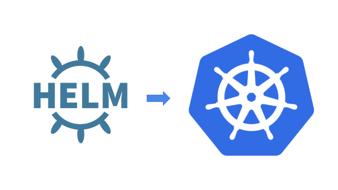

## HELM 

Helm (del término marítimo de timón) es una herramienta para gestionar aplicaciones de Kubernetes.
Helm te ayuda a "timonear" Kubernetes usando cartas de navegación que se conocen como Helm Charts.

La principal función de Helm es definir, instalar y actualizar aplicaciones complejas de Kubernetes.
Helm es mantenido por la CNCF en colaboración con Microsoft, Google, Bitnami y la comunidad de Helm.

### Helm charts

Las cartas de navegación permiten crear, versionar y publicar una aplicación Kubernetes.
Cuando usamos Helm Charts tenemos un asistente de optimización que facilita la administración e instalación de las apps en Kubernetes y el proceso de empaquetamiento.

Helm Charts se divide en dos: una parte es Helm, como cliente y la otra es Tiller como servidor.

### Tiller (server)

Es el componente que se encarga de la gestión de los Charts, específicamente en sus instalaciones. Es decir el servidor
Interactúa directamente con el API de Kubernetes para instalar, actualizar, consultar y eliminar recursos de Kubernetes.
También almacena los objetos de cada release o distribución.

### Helm (client)

Helm se ejecuta directamente en un equipo o en el dispositivo elegido para la ejecución.
Los paquetes Helm están compuestos de una descripción del paquete y de archivos contenedores de manifiestos Kubernetes.

### Beneficios Helm

Los Helm Charts sirven para describir incluso las aplicaciones más complejas.
Ofrecen una instalación repetible de la aplicación, manteniendo un único punto de control.

Las actualizaciones de Helm Charts son sencillas y más fáciles de utilizar para los desarrolladores.
Los Helm Charts buscan ser fáciles de versionar, compartir y alojar a través de tecnologías cloud.

Al desplegar una aplicación nueva, es posible tener de devolverla por cualquier razón.
El proceso de “rollback” con Helm Charts es sencillo: se usa para retroceder la versión a una publicación anterior en caso de que el proceso no haya sido satisfactorio.

Una de las funciones más interesantes de este software es que nos permite crear nuestras propias cartas de navegación.

### Instalación y documentación

https://helm.sh/es/docs/intro/install/

