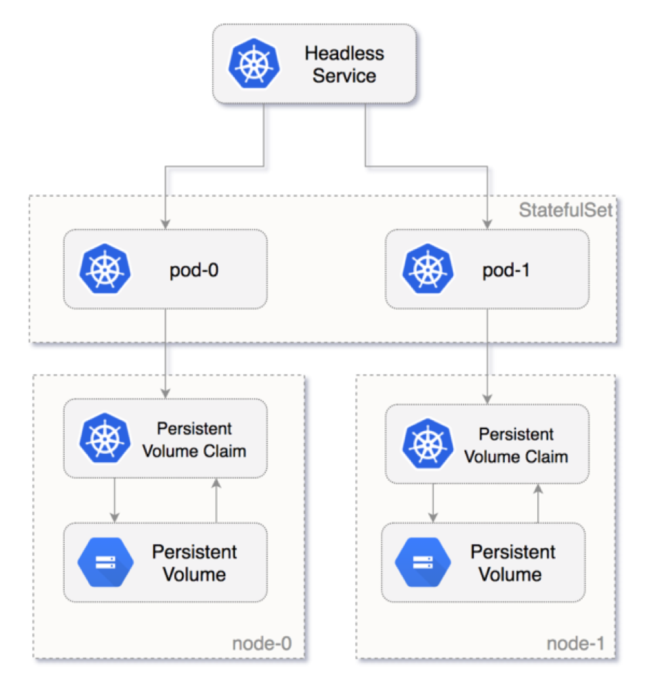
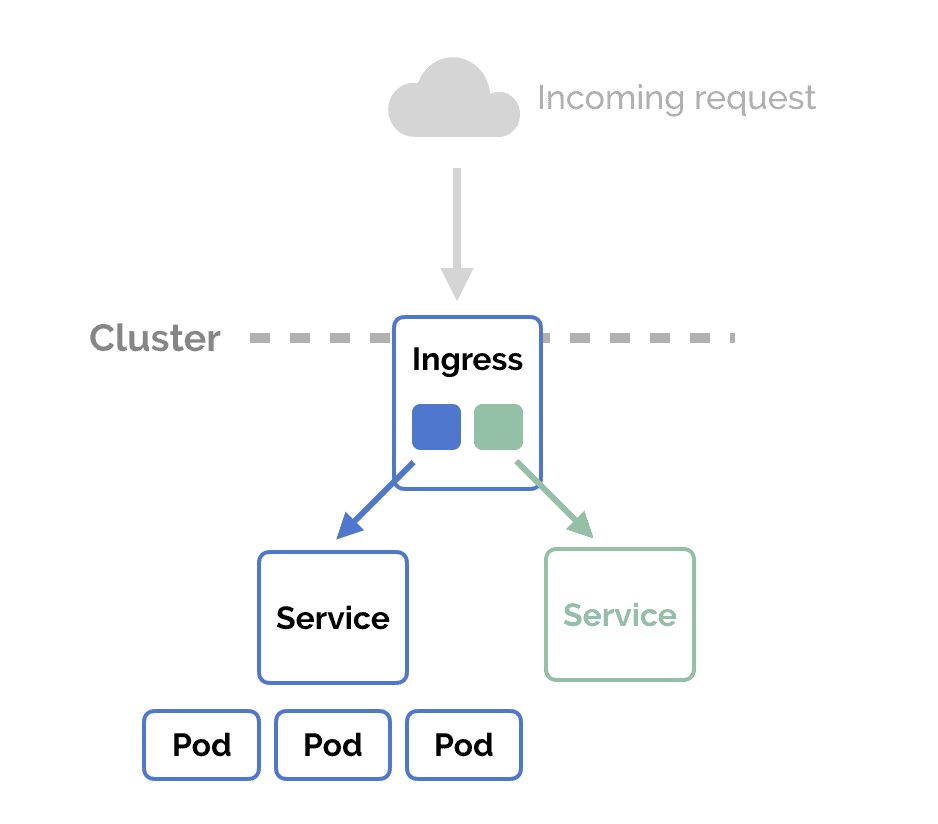

<h4 align="center"> ¿Qué es Kubernetes y qué ofrece?</h4>

</img>

---------------------------------------------------

<h4 align="center">Clúster</h4>

</img>

---------------------------------------------------
<h4 align="center">Nodos</h4>

</img>

---------------------------------------------------
<h4 align="center">Pods</h4>

</img>

---------------------------------------------------
<h4 align="center">Replicaset</h4>

</img>

---------------------------------------------------

<h4 align="center">Deployment</h4>

</img>

---------------------------------------------------

<h4 align="center">Volumenes</h4>

</img>

---------------------------------------------------

<h4 align="center">Configmaps</h4>

</img>

---------------------------------------------------

<h4 align="center">Secret</h4>

</img>

---------------------------------------------------
<h4 align="center">Namespaces</h4>

</img>

---------------------------------------------------

<h4 align="center">Rbac</h4>

</img>

---------------------------------------------------

<h4 align="center">Services</h4>

</img>

---------------------------------------------------

<h4 align="center">Ingress</h4>

</img>

---------------------------------------------------

