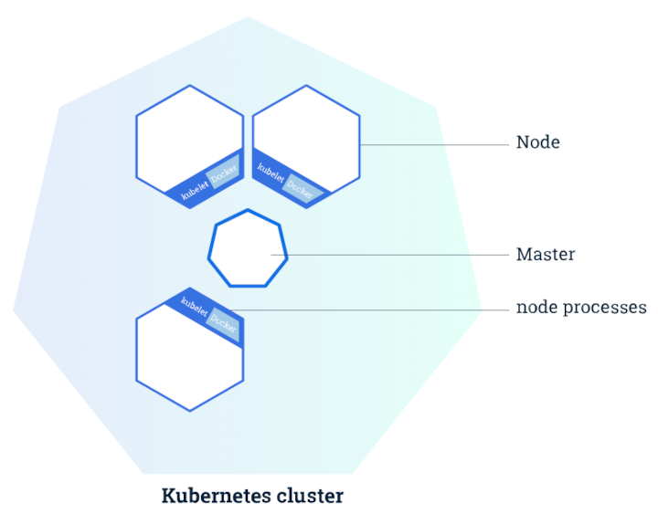
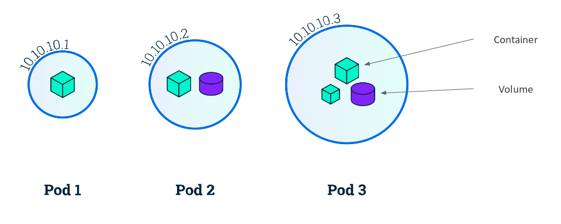
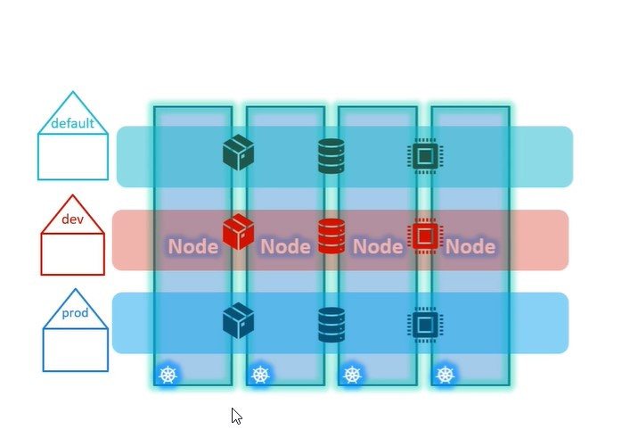
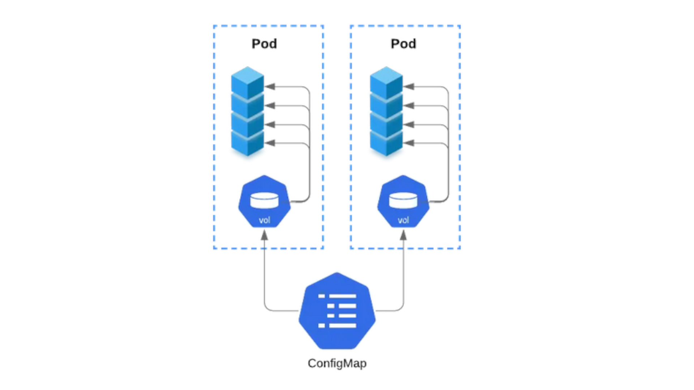

## CLUSTER

- ¿qué es?

- manera de implementar un clúster

## NODES

- ¿qué es un node?

- Master node (control-plane)

	- definición y funciones

	- procesos:

		- API server

		- Scheduler

		- Controller-manager

		- Etcd

- Worker node 

	- funciones

	- procesos

		- container runtime

		- kubelet

		- kube-proxy

## PODS

- definición

- ip + puerto

- acceso a volúmenes compartidos

- uso

---

# NAMESPACES

- Definición

- agrupar, entornos

- 3 namespaces por defecto

- crear namespaces

---

# CONFIGMAPS

---

---

# RBAC

- Definición y uso

- Usuarios: como crearlos

- Permisos:

	- Role

	- ClusterRole

	- RoleBinding

	- ClusterRoleBinding

